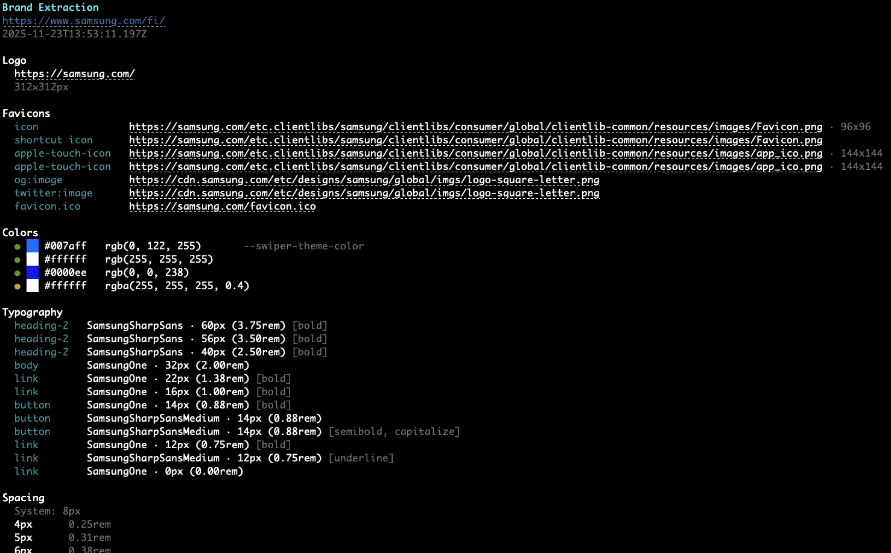

# 🎨 Dembrandt

[](https://www.npmjs.com/package/dembrandt)
[](https://www.npmjs.com/package/dembrandt)
[](https://github.com/thevangelist/dembrandt/blob/main/LICENSE)

Extract any website’s design system into design tokens in a few seconds: logo, colors, typography, borders, and more. One command.



## Install

```bash
npx dembrandt bmw.de
```

Or install globally: `npm install -g dembrandt` then run `dembrandt bmw.de`

Requires Node.js 18+

## What to expect from extraction?

- Colors (semantic, palette, CSS variables)
- Typography (fonts, sizes, weights, sources)
- Spacing (margin/padding scales)
- Borders (radius, widths, styles, colors)
- Shadows
- Components (buttons, inputs, links)
- Breakpoints
- Icons & frameworks

## Usage

```bash
dembrandt <url>                    # Basic extraction
dembrandt bmw.de --save-output     # Save JSON to output folder
dembrandt bmw.de --json-only       # JSON output only (no save)
dembrandt bmw.de --debug           # Visible browser
dembrandt bmw.de --dark-mode       # Dark mode
dembrandt bmw.de --mobile          # Mobile viewport
dembrandt bmw.de --slow            # 3x timeouts
```

By default, results display in terminal only. Use `--save-output` to save JSON to `output/bmw.de/YYYY-MM-DDTHH-MM-SS.json`

## Use Cases

- Brand audits & competitive analysis
- Design system documentation
- Reverse engineering brands
- Multi-site brand consolidation

## How It Works

Uses Playwright to render the page, extracts computed styles from the DOM, analyzes color usage and confidence, groups similar typography, detects spacing patterns, and returns actionable design tokens.

### Extraction Process

1. Browser Launch - Launches Chromium with stealth configuration
2. Anti-Detection - Injects scripts to bypass bot detection
3. Navigation - Navigates to target URL with retry logic
4. Hydration - Waits for SPAs to fully load (8s initial + 4s stabilization)
5. Content Validation - Verifies page content is substantial (>500 chars)
6. Parallel Extraction - Runs all extractors concurrently for speed
7. Analysis - Analyzes computed styles, DOM structure, and CSS variables
8. Scoring - Assigns confidence scores based on context and usage

### Color Confidence

- High — Logo, brand elements, primary buttons
- Medium — Interactive elements, icons, navigation
- Low — Generic UI components (filtered from display)
- Only shows high and medium confidence colors in terminal. Full palette in JSON.

## Limitations

- Dark mode requires --dark-mode flag (not automatically detected)
- Hover/focus states extracted from CSS (not fully interactive)
- Canvas/WebGL-rendered sites cannot be analyzed (e.g., Tesla, Apple Vision Pro demos)
- JavaScript-heavy sites require hydration time (8s initial + 4s stabilization)
- Some dynamically-loaded content may be missed
- Default viewport is 1920x1080 (use --mobile for responsive analysis)

## Ethics & Legality

Dembrandt extracts publicly available design information (colors, fonts, spacing) from website DOMs for analysis purposes. This falls under fair use in most jurisdictions (USA's DMCA § 1201(f), EU Software Directive 2009/24/EC) when used for competitive analysis, documentation, or learning.

Legal: Analyzing public HTML/CSS is generally legal. Does not bypass protections or violate copyright. Check site ToS before mass extraction.

Ethical: Use for inspiration and analysis, not direct copying. Respect servers (no mass crawling), give credit to sources, be transparent about data origin.

## Contributing

Bugs you found? Weird websites that make it cry? Pull requests (even one-liners make me happy)?

Spam me in [Issues](https://github.com/thevangelist/dembrandt/issues) or PRs. I reply to everything.

Let's keep the light alive together.

@thevangelist

---

MIT — do whatever you want with it.
